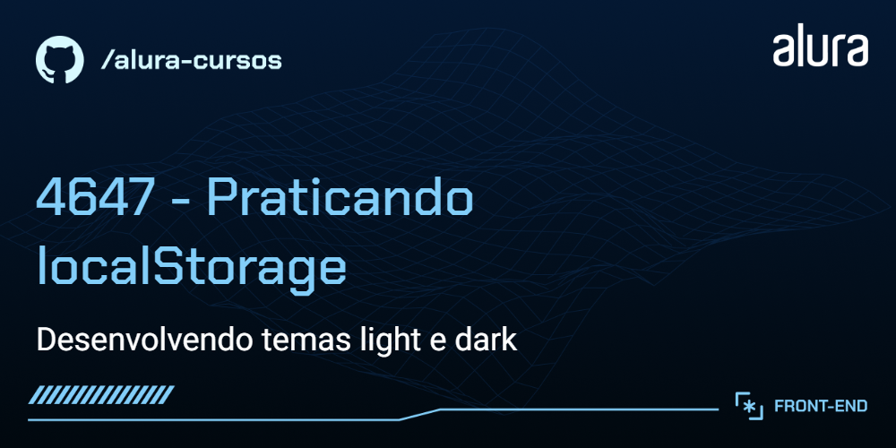
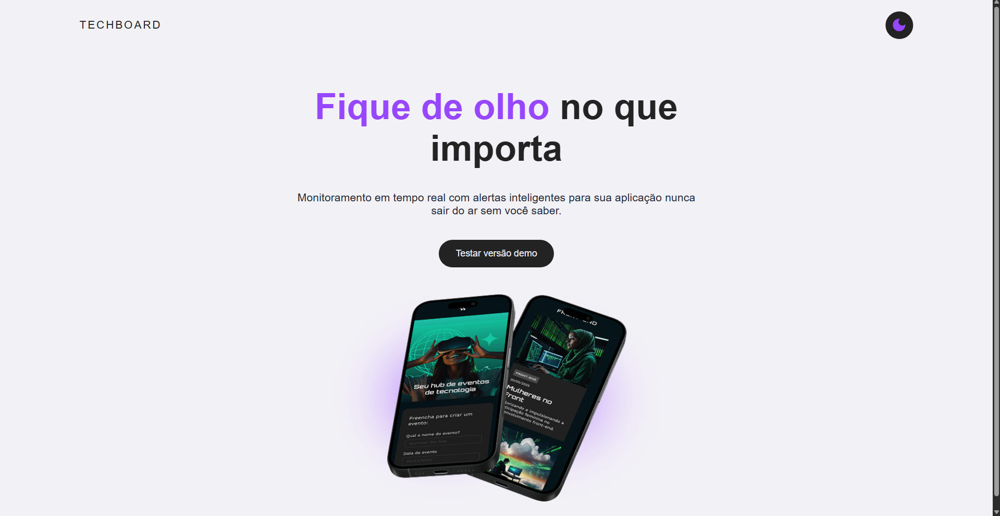

# Techboard

App de monitoramento em tempo real com alertas inteligentes para sua aplicação nunca sair do ar sem você saber.

  
  

## 🔨 Funcionalidades do projeto

- Landing page com a funcionalidade de alternar entre os temas claro e escuro.
- Mantém as preferências de temas do usuário salvas no localStorage e possui sincronização de dados do localStorage entre abas e janelas que compartilham do mesmo armazenamento local.

## ✔️ Técnicas e tecnologias utilizadas

As técnicas e tecnologias utilizadas pra isso são:

- `HTML`: para estrutura e marcação das tags semânticas da aplicação;
- `CSS`: para os estilos da página e configuração de tema claro e escuro;
- `JavaScript`: para lidar com a lógica de alternar entre temas e sincronizar as informações salvas entre abas e janelas que compartilham o mesmo armazenamento local;

## 📁 Acesso ao projeto

Você pode [acessar o código fonte do projeto inicial](https://github.com/NeiltonSeguins/4647-praticando-localstorage) ou [baixá-lo](https://github.com/NeiltonSeguins/4647-praticando-localstorage/archive/refs/heads/main.zip).

## 🛠️ Abrir e rodar o projeto

Após baixar o projeto, faça a extração da pasta para o local de sua preferência.

- Abra o projeto em sua IDE favorita. Eu recomendo o [Visual Studio](https://code.visualstudio.com/)
- Abra o arquivo `index.html` no seu navegador ou utilize a extensão [Live Server](https://marketplace.visualstudio.com/items?itemName=ritwickdey.LiveServer) para rodar o projeto.

## 📚 Mais informações do curso

Gostou do projeto e quer conhecer mais? Você pode [acessar a formação completa](https://cursos.alura.com.br/formacao-javascript-front-end) que te ensina como dominar o JavaScript no navegador!
